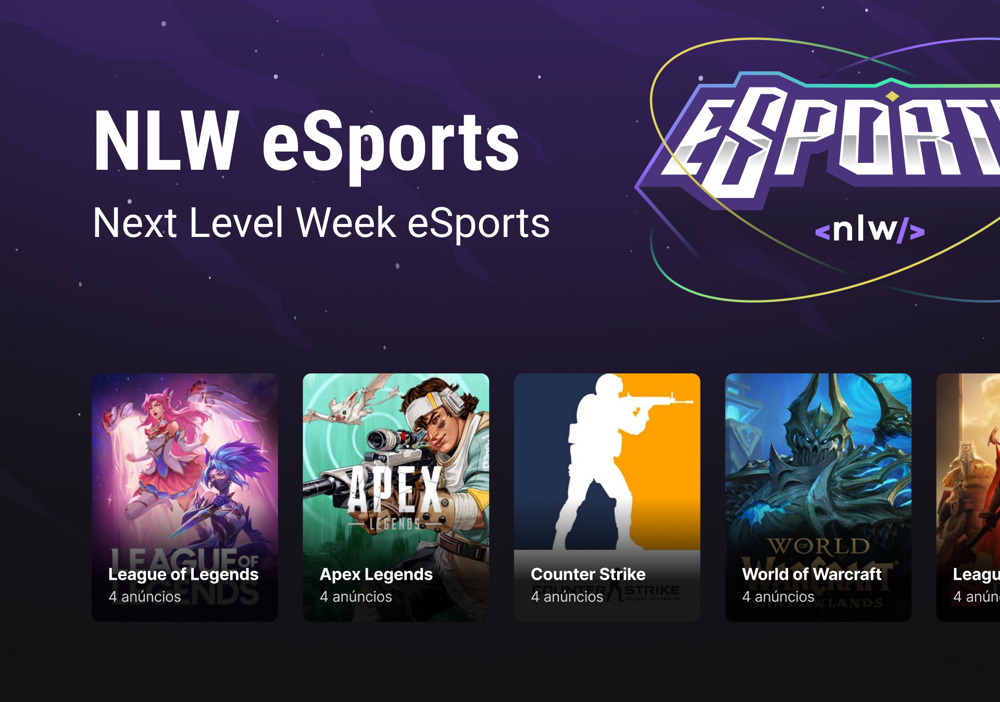

# Match Duo
<h3 align = "center">
    
</h3>

---

## Projeto

Aplicação para encontrar um parceiro(a) para jogar

 

## Tecnologias Utilizadas 

<ul>
  <li>React</li>
  <li>React Native</li>
  <li>React Navigation</li>
  <li>Typescript</li>
  <li>Tailwind CSS</li>
  <li>Phosphor Icons</li>
  <li>Radix</li>
  <li>Axios</li>
  <li>Expo</li>
  <li>Express</li>
  <li>Prisma</li>
 </ul>
 
## Fonte do Layout
 [Template do Match Duo](https://www.figma.com/community/file/1150897317533332617)
